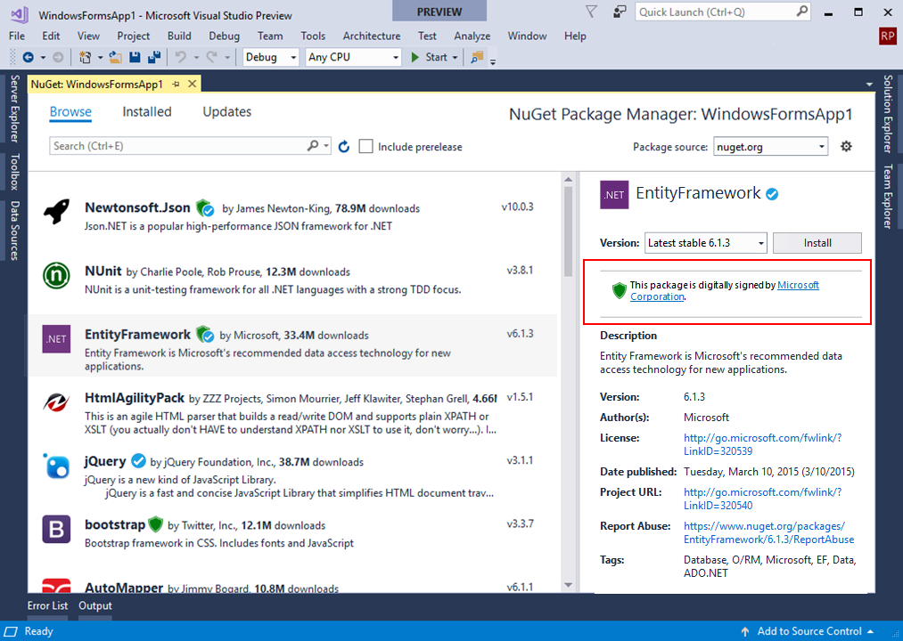

Status: **Reviewing**

## Related Information
This specification is one part of a new experience for package signing described at a high level in this blog post:  [NuGet Package Signing](https://blog.nuget.org/20170914/NuGet-Package-Signing.html). You can find various related specs on the [package signing wiki](https://github.com/NuGet/Home/wiki/Package-Signing). 

## Issue
The discussion around this spec is tracked here - **Author Package Signing [#5889](https://github.com/NuGet/Home/issues/5889)** 

## Problem

NuGet packages do not include any mechanism to determine if a given package has been modified from creation to consumption or who is the legitimate author of the package. These issues are becoming more relevant when users configure their solutions with different package sources, where it’s common to use mirrors that copy packages from different sources.

## Who is the Customer?
Package Authors who want to provide a stronger authenticity mechanism to their packages.

Package consumers who require more information to help making trusted decisions based on their security constraints.

## Key Scenarios
Package authors have the option to sign their packages before submission. NuGet.org will validate signed packages during submission if the package is validated it will include a new visual indicator in the search results. 

Consumers will be able to identify signed packages in NuGet.org, including a signer from the certificate. Those packages will be validated while installing and will be blocked if the content has been tampered.

When the signing certificate does not chain to a trusted root on the local machine where the package is being installed, the installation will generate a warning.

## Solution 

As described in the [blog post](https://blog.nuget.org/20170809/NuGet-Package-Signing.html), this feature corresponds to the Stage 1 of the overall roadmap for Package Signing. Signed packages will not be strictly required by NuGet.org, Visual Studio or NuGet.exe. Authors and consumers can decide if they want to start using the feature at their own pace. 

NuGet packages can be signed with an embedded  signature based on  X.509 code signing certificates. This signature will provide a mecahnism to validate pacakge integrity (the content has not been modified) and authenticity (the package author has possession of the certificate at the time of signing).

### New icons to identify signed packages

Consumers will be able to install signed and unsigned packages. The only change they will notice is a visual indicator in the search results to show if the package is signed.

This visual indicator will also be used to show if the Package ID has been verified, as described in the related spec [Package Identity and Verification](https://github.com/NuGet/Home/wiki/NuGet-Package-Identity-Verification)

|Icon|Description|
|----|:-----|
||This package has been signed by **\[Author from certificate Subject\]**. |
||The identity of this package has been verified by **\[Package Source Name\]**. |
|| This package has been signed by **\[Author from certificate Subject\]**. The package identity has been verified by **\[Package Source Name\]**.|

#### Search results
These icons will be shown in the Package Manager Explorer when the user browse or search for packages.

The visual indicators will be shown based on a property included in the search API. Not all package sources will implement this features, and only the sources returning the updated metadata will shown the green shield.

Initially the left pane with the search results, will show the green shields when the package source is selected to NuGet.org only. We will support local feeds and multiple feeds in Stage 2.

>Note: Signed packages will not affect the rank algorithm used to sort the search results.

#### Package details

When the user selects a signed package, the details pane will show the signer information from the  the Subject in the certificate. Clicking on the link will open the certificate.

The v3 registration feed will be augmented to include another field (e.g. signaturesUrl) that points to another URL that will return the signature details for that specific pakckage version.

#### Signature validation at install time 

NuGet clients like Visual Studio and NuGet.exe will try to validate the signature when available. If the package does not contain a signature it will be installed without any noticeable change from existing workflows.

The package signature will be validated before the package gets expanded to the local file system (the .nupkg files are zip files that need to be extracted somewhere), usually as a result of an install, restore or update operation.

This validation will verify the content has not been modified since signing and the certificate chains to a trusted root in the local machine.

This validation will end with three possible results that will be shown in the output (Error List in Visual Studio and Std Error in NuGet.exe). The CLI for .NETCore apps will now validate package signatures till we are done with Stage 3, and hence no errors/warnings will be shown.

|Status|Message|Description|
|:-----|:------|:---------|
|OK|Signature Validated| Good package signature|
|Warning|Certificate Non Trusted| The certificate using to sign this package is not trusted.|
|Error|Content Tampered| The content of this package has been modified. Installation is cancelled|

### Signing Packages

NuGet package authors who want to sign a package must obtain a X.509 code signing certificate. It’s strongly recommended to obtain the certificate from a public certification authority. The author can also use a certificate from a private certification authority but these signatures will generate a warning if the certificate is not trusted in the machine where the validation will occur.

> Note: Detailed certificate requirements are outside the scope of this document. The detailed requirements are available in the spec [Package Signatures Technical Details](https://github.com/NuGet/Home/wiki/Package-Signatures-Technical-Details)

During the signing time, the certificate will be validated to make sure it's a valid code signing certificate that has not been revoked.

The output of this operation will be an updated version of the nupkg file with an embedded signature.

Packages can contain 0 or 1 signatures, if the author tries to sign an already signed package, the previous signature will be removed before signing it again.

### Submitting a signed package 

>Note: If the package source is a folder, there are no extra steps, and copying the signed nupkg to the destination folder will be enough.

When submitting to a NuGet server, the signature will be validated against the server policies.  In the case of NuGet.org this policy will require:

- The content has not been modified since signing
- The certificate chains to a trusted root by NuGet.org 
    - NuGet.org will use the trusted CAs published by Windows
- All certificates in the chain were not known to be revoked at the time of the signing
    - If the revocation respondants are not available the validation will fail.

We will announce when NuGet.org will start validating signatures during the submission process in our [Announcements repo](https://github.com/NuGet/Announcements).

>Note: If the submitted package has no signatures, the package will be allowed but it will not get the visual indicator.
