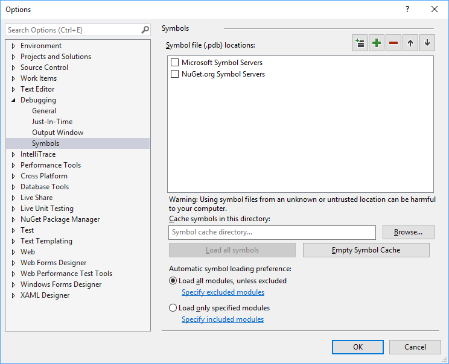

Status: **Reviewing**
# NuGet Package Debugging & Symbols Improvements
This spec defines our plans for improving the NuGet package debugging and symbols management experience. 
## GitHub Issue
Let us know what feedback you have at the GitHub [issue](https://github.com/NuGet/Home/issues/6104) tracking this experience:
 - **Improve NuGet package debugging and symbols experience [#6104](https://github.com/NuGet/Home/issues/6104)**

## Summary
There are several issues with the NuGet package debugging and symbols experience today, including:
* Discoverability issues in the tooling
* Symbol service performance and maintenance issues, including the upcoming deprecation of the service
* Lack of support for portable PDBs
* Various ways to include source information with no prescribed methodology built into the tooling
* Since Symbols and .nupkgs are maintained by separate services, providing a first-class experience for both is impossible to do

The spec below proposes a set of solutions to solve the above problems to create a streamlined package debugging experience for the entire NuGet ecosystem. 

## Terminology
Before getting too deep in the details, I first want to clarify some of the terminology around symbols, symbol packages, and more.
* **Symbol**: In this document, we use 'symbol' to represent a debug symbol, which attaches additional information to a .dll or .exe that allows a debugger to gain access to info from the source code. More info can be found on the [Wikipedia page](https://wikipedia.org/wiki/Debug_symbol). This document pertains to the .pdb (Program Database) format of Symbols.
* **Embedded symbol**: An embedded symbol means the debug symbol information is embedded in the .dll, resulting in an experience that only requires a single file for both assembly and debug info. This will result in a larger file than if the symbol is not embedded
* **Symbols package**: A symbols package is a special type of .nupkg that is currently designated by the package name `{package ID}.symbols.nupkg`. The symbols package is similar to the .nupkg, but it also includes the .pdb (symbol) files. More information is available in the [NuGet documentation](https://docs.microsoft.com/nuget/create-packages/symbol-packages).
* **Portable PDB**: This is a new symbol format introduced with .NET Core. Portable PDBs are smaller than traditional Windows PDBs, they are cross-platform, and they are more secure. Even though the Portable PDB format was introduced with .NET Core, it can be created and consumed by .NET Framework applications. More info about Portable PDBs is available on the [.NET GitHub](https://github.com/dotnet/core/blob/master/Documentation/diagnostics/portable_pdb.md)
* **[Windows] PDB**: The traditional .pdb format is typically much larger than a similar portable PDB counterpart. More info is available on the [Wikipedia page](https://wikipedia.org/wiki/Program_database). There are currently several tools available that only support Windows PDB. 
* **SourceLink**: [SourceLink](https://github.com/ctaggart/SourceLink) is a .NET library that makes it easy for developers to add on-demand source code information in their symbols. When SourceLink is used while debugging with symbols, the source files are downloaded on demand and only when needed by the debugger.
* **Embedded Source**: You can embed all source files (or a subset of source files) into a .pdb for step-debugging in Visual Studio or other IDEs. This will make the .pdb file larger, but no additional files will need to be downloaded for debugging.

With the terminology out of the way, let's get into the experience as it exists today, including some of the problems we have.

##  NuGet Debugging Experience Today
Currently, the NuGet package debugging story requires many steps that could be streamlined for a better experience, and doesn't support the full gamut of .NET development scenarios. Both the package authoring and package consuming experience are convoluted. The existing experience is described below.

### Package Authoring Experience
If a package author wants to make their package debuggable, they must take several steps. The steps, with associated problems, are listed below. 
1. First, when creating their .nupkg, they must also create a .symbols.nupkg (instructions [here](https://docs.microsoft.com/en-us/nuget/create-packages/symbol-packages))
    1. There is little real guidance or tooling to help determine which type of .pdb to leverage, or whether or not the .pdb should be embedded or separate
    2. In addition, there is little guidance or tooling to help developers provide source information if they choose to do so.
2. After creating the .symbols.nupkg, the package author must then upload both the .nupkg and the .symbols.nupkg.
    1. The .nupkg and the .symbols.nupkg get uploaded to different endpoints. Currently, SymbolSource acts as the symbol server for NuGet packages. There are several issues associated with this experience, called out under the [Symbol Server Experience](#SymServ) section

### Package Consuming Experience
If a package consumer wants to debug a NuGet package, they must take several steps. The steps, with associated problems, are listed below.
1. First, they need to know about debugging NuGet packages, and how to add the Symbol server to their IDE to restore symbols.
    1. This is only in documentation. For developers new to NuGet, they may have no clue that NuGet packages are debuggable. 
2. Next, they need to know whether or not a symbols package has even uploaded symbols that are consumable. 
    1. The only possible source of this information must come from an announcement of the package author. There is no universal way to determine whether or not a package has symbols available. 
3. Finally, they need to add the SymbolSource symbol server [https://nuget.smbsrc.net](https://nuget.smbsrc.net) as a source for symbols in their IDE to download and consume symbols. 
    1. This is not an obvious step. Developers need to go out of their way to figure this out. 

### Symbol Server Experience 
SymbolSource has provided a great service to the .NET Community for years. As .NET has grown and evolved, the service has begun encountering several issues that are worth mentioning.
1. The SymbolSource symbol server does not currently support the new Portable PDB format 
2. SymbolSource has had latency issues in the past, both on upload and symbols download. This occasionally manifests in request timeout on push operations.
3. Scale, maintenance, and management is becoming an increasing concern for the maintainers of the service
4. It has occasionally introduced [publishing reliability issues](https://github.com/NuGet/Home/issues/6082) that resulted in a poor state for package authors.

In addition, SymbolSource may be [shutting down](https://twitter.com/TripleEmcoder/status/956504904725684224) soon. We are actively working with Marcin (the owner of SymbolSource) to help figure out the future of SymbolSource. 

## Solution 

With the above experience in mind, the NuGet team plans to invest in improving the following areas to improve the NuGet package debugging experience for the entire .NET community:
* In collaboration with the .NET team, make it easy for developers to create debuggable NuGet packages and link their source code to their NuGet packages in the package creation process.
  * The default NuGet Client tooling will automatically generate and publish Symbols packages when creating NuGet packages.
* Optimize the uploading experience of symbols packages so that only one command is necessary for both the NuGet package and the symbols package.
* Streamline the NuGet package debugging experience in Visual Studio so that the [NuGet.org](https://www.nuget.org/) symbol server source can be added with the click of a button. 
* Make it more evident that a package on NuGet.org has symbols available on the NuGet symbol server by adding UI on NuGet.org and in the Visual Studio package manager that designates whether or not symbols are available.
* Improve performance and scale of symbol server infrastructure by hosting our own service.

**Note:** This will be supported in the NuGet v3 protocol. It will also work for third party NuGet servers that implement the v3 protocol.

### NuGet Package Authoring Experience
The NuGet package authoring experience will be improved in the following ways:
* For .NET Framework and .NET Core projects, we will make it easy to create NuGet symbols packages with portable PDBs. The tooling will also allow you to determine how you want to include source info (if you want to include it at all). See the [source linking](#SourceLinking) section for more info.
* When publishing packages to NuGet.org, you will publish symbol packages just like normal .nupkgs. If you use API keys, you will use the same API key for both the NuGet package and the Symbols package. Additional features specific to .nupkgs will also be applied to symbols packages, including:
    * The ability to sign packages
    * ID prefix reservation
    * Scoped API keys
* When publishing packages, both the symbols package and the .nupkg will be easily published to NuGet.org, or to any NuGet server that opts into this experience.
* We will simplify the format of NuGet Symbols packages to only require the .pdbs and .nuspec (rather than a superset of the .nupkg including the assembly). We will also change the file extension to .snupkg, so tools relying on wildcards (e.g. *.nupkg) can more easily distinguish between NuGet packages and Symbols packages. In addition, this allows developers to recognize a package that adheres to the old format versus the new format. 

The default symbols experience will be to create multiple packages - one for symbols (.snupkg) and one for the binaries (.nupkg) - so that we do not bloat package size and impact package restore times. Even though portable PDBs are drastically smaller than Microsoft PDBs, they still account for ~50% of the binary size (a 5 MB .nupkg may yield a 2.5 MB .snupkg with Portable PDB). With this in mind, we do recognize some members of the community asking for improved embedded PDB support in the .nupkg and will be looking for feedback to best solve this problem. We still need to evaluate the best experience for including a single-file solution, and would love your feedback on this topic in the [GitHub issue](https://github.com/NuGet/Home/issues/6104).

If a .pdb is included in a normal .nupkg, NuGet and NuGet.org will not do any special validation or indexing of the .pdbs. Debugging of the .nupkg will work in a limited way as the symbols will be cached next to the .dll, but it will not be indexed and downloaded from a symbol server. The only way to ensure indexing on the symbol server is to include the .snupkg. If the symbols are not indexed, certain scenarios will not work, such as crash dump debugging and attaching to an application. 

### NuGet Package Consumer Improvements
One of the difficulties for symbol consumption from NuGet package consumers is recognizing the availability of the symbol server and manually adding the server endpoint to Visual Studio. We plan to make the NuGet symbol server a default option in the Visual Studio debug options, so opting in to NuGet package symbols is as easy as clicking a check box in Visual Studio.

The new Visual Studio default 'Symbols' experience will look similar to the below:

In addition, we will add metadata to the NuGet protocol to determine if a package has symbols available on the NuGet symbol server. We can surface this information in the NuGet package manager UI, and on NuGet.org. This will improve discoverability of the debuggability of NuGet packages, as well as let you know which packages are debuggable. 

Finally, we will make the .snupkg downloadable from the NuGet.org gallery. 

### Improving NuGet Symbol Server Infrastructure
To make sure the NuGet symbol server infrastructure is capable of handling the growing .NET ecosystem and evolving symbol technology, we have decided to host our own symbol server with support for the scale that the .NET community requires. 

### Source Linking with NuGet Packages 
There are several options to provide source code for step debugging with symbols:
1. SourceLink to embed a reference in the PDB to a remote source to get the code. This is the recommended way and will be built into the tooling by default.
2. PDB embedded sources, which provides the source code directly in the PDB
3. Fully embedded PDBs, providing all debugging information *and* source code in the .dll
4. Including the source files in the .nupkg directly. This method is no longer recommended and will not be supported in the tools.

With performance being top of mind, we believe providing the best experience for SourceLink in NuGet symbols packages is our most valuable investment in the short term. This will optimize the package size for both the NuGet packages and the symbols. When you step through the code, *only* the source that you need is downloaded as soon as you need it. The other three options all increase the NuGet package size. These options will still available to developers, but the tooling will be streamlined for SourceLink, and the documentation will clearly call out how to do all four options. 

## Managing Security with Symbols
One benefit of having [NuGet.org](https://nuget.org) act as a single service for both libraries and symbols is that we have a single place of managing authentication and identity. When you consume a NuGet package from NuGet.org, you will have certainty that both the NuGet package and symbols (coming from the NuGet symbol servers) are coming from the same package owner.

Further, a set of requirements will be imposed on submission for symbols to be publicly indexed on the NuGet.org symbol server. These are listed in the next section.

## Symbols Package Requirements 
To ensure that the uploaded symbols exactly match the uploaded .dlls, we are working with the compiler teams to store [hashes of the .pdbs](https://github.com/dotnet/roslyn/issues/24429) generated from a .dll in the .dll itself. This will be a requirement for uploading .nupkgs and .snupkgs to NuGet.org. The full requirements to upload a .snupkg to NuGet.org are:
1. To upload any .snupkg to NuGet.org, the hash of the .pdbs must be included in the .dlls that are included in the matching .nupkg.
   1. **Note:** This means you will need to recompile and package your .nupkg with a compiler that supports this feature.
2. For managed .dlls, only the portable PDB format will be supported. The portable PDB format can be created and consumed for any .NET application provided that the consuming client is on .NET 4.7.1 or later. The portable PDB format has inherent security advantages compared to Windows PDBs.
3. For native .dlls, the following restrictions will be placed on uploading Windows .pdbs:
   1. Only .pdbs that do not contain SourceSrv info or ENC will be allowed to be uploaded. Anything that can execute arbitrary shell scripts will be rejected.

### Symbols Tools Requirements
In addition to the above upload requirements, you will need a tool capable of reading the portable .pdb format to consume the symbols on NuGet.org. This includes Visual Studio 2015 Update 2 and later (including Visual Studio 2017). We are working on bringing portable .pdb support to additional tooling, including Visual Studio Code on all platforms and WinDBG.

## Roadmap
This spec consists of several key components called out at the beginning of the [Solution](#Solution) section. These are listed in order of implementation, and repeated below.
1. Microsoft compiler teams are working on embedding .pdb hashes in the .dll to meet our upload requirements
2. We will then bring up our own Symbol server and we will add a support to the [NuGet.org](https://nuget.org) v3 protocol to support pushing packages *and* symbols packages to NuGet.org. This will also include the metadata to determine if a package has associated symbols on the NuGet symbol server.

After we have implemented these two steps, we will allow submissions to NuGet.org. It will require some manual steps to push to the symbol server, but we will be open for submissions for .nupkgs and .snupkgs.

3. In tandem, we will be working on improving the dotnet and nuget CLIs and tooling to more easily generate symbols packages, provide source information, and streamline the publishing process for .nupkgs and .snupkgs. 
4. In a future Visual Studio release, we will add the [NuGet.org](https://nuget.org) symbols server as a default symbols server selection in the tooling. In addition, the Visual Studio debugger will validate .pdb hashes in the .dll in addition to the NuGet.org gallery at ingestion. 

## Open Issues
1. Figure out the details of SymbolSource going forward, including a transitionary plan for existing symbols and packages. Expect a blog post from the NuGet team and the owner of SymbolSource to address this soon. 
2. How do we support preemptively caching symbols for offline scenarios
