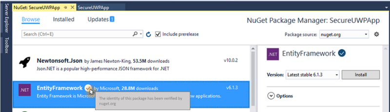
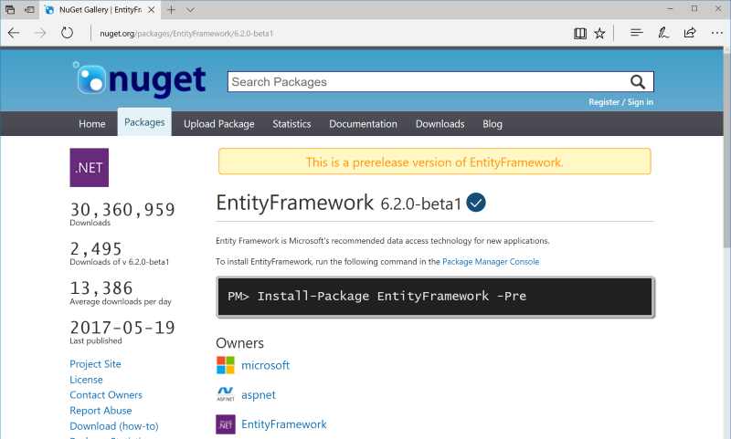
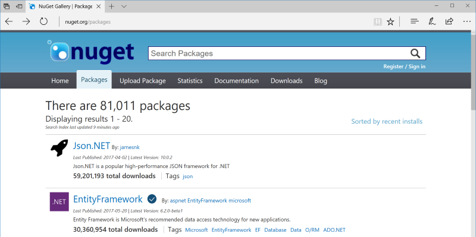

We've heard from our customers loud and clear that there is confusion regarding NuGet package identity today. There are several key identifying properties for NuGet packages, including: package owners, package author, package title, and package ID. Each of these properties serves a unique purpose, but having different identifying metadata can make it difficult for NuGet package consumers to quickly and easily find the right package for consumption.

This spec outlines in detail our immediate plans for engineering investment. In addition, we describe our longer term roadmap for areas of investigation and investment to complete the picture over time. To be able to roll out as quickly as possible, we plan to start small and grow over time. This gives us an additional opportunity to learn from our customers to make sure the final set of features provides the most value to the entire NuGet community. 

# Table of Contents
* [NuGet Package ID Prefix Reservation](#nuget-package-id-prefix-reservation)
  * [Goals for Package ID Prefix Reservation](#goals-for-package-id-prefix-reservation)
  * [What Does a Reserved Package ID Prefix Do?](#what-does-a-reserved-package-id-prefix-do)
  * [Criteria for Prefix Reservation](#criteria-for-prefix-reservation)
  * [Application Process for Package ID Prefix Reservation](#application-process-for-package-id-prefix-reservation)
  * [Application Prioritization](#application-prioritization)
  * [Identity Verification Visual Indicator](#identity-verification-visual-indicator)
* [Next Steps - Long Term Roadmap](#next-steps---long-term-roadmap)
  * [Evolution of Package Identity](#evolution-of-package-identity)
  * [Additional Package Security Investments](#additional-package-security-investments)

# NuGet Package ID Prefix Reservation
The first feature we will implement is what we are calling package ID prefix reservation. This feature will allow NuGet package owners to submit an application to reserve a package ID prefix glob pattern. This feature will be open to any NuGet package contributor who believes they meet the [criteria for prefix reservation](#criteria-for-prefix-reservation). This feature will be exclusive to the nuget.org package feed and will be associated with user accounts on nuget.org. 

## Goals for Package ID Prefix Reservation
Before we get deep into the details, let's discuss our goals for the package ID prefix reservation. These are derived from a combination of our discussions with customers and community feedback, as well as the reality of the cost of engineering and the amount of resources available. These goals are what drive the remainder of the spec - especially the [criteria](#criteria-for-prefix-reservation) and the [application prioritization](#application-prioritization). 
1. First and foremost, we want to clear up as much package identity confusion as possible for as many NuGet package consumers as possible.
2. Next is brand protection for top .NET contributors who are at risk of having their identity mistaken or confused.
3. Thirdly, we want to set ourselves up for success to expand this set of features in the [long term](#next-steps---long-term-roadmap).
4. In addition, we want to start small and expand over time so if we need to pivot or adjust, the impact on the community is minimized. 
5. Last, but certainly not least, we want to learn from the community throughout this process. As we develop, we constantly want input to help us drive our future investments and help us prioritize some of the items on our [roadmap](#next-steps---long-term-roadmap).

As you read through the rest of the spec, please keep these goals in mind.

## What Does a Reserved Package ID Prefix Do?
When an application for a reserved package ID prefix is accepted by the nuget.org team based on the [criteria](#criteria-for-prefix-reservation) below, the owner will have the following changes made to their account: 

* All packages submitted in the future that match the reserved package ID prefix glob pattern must come from the owner who has reserved the ID prefix.
* The package owner who reserved a package ID prefix will be able to arbitrate subsets of the glob pattern to other account owners, or to all package owners.
  * Example 1: for an open source project, the root glob pattern could be reserved (MyOpenSourceLib.\*) by a community backed NuGet account, but the community could open a subset of the prefix (MyOpenSourceLib.Extension.\*) to *all* package owners. 
  * Example 2: for a large organization with many teams contributing each with their own NuGet account, the organizational account can reserve the base glob pattern (e.g. Microsoft.\*), and then arbitrate subsets to individual owners (e.g. Microsoft.AspNet.\*).
* Packages that match the reserved package ID prefix glob pattern will have an [identity verification visual indicator](#identity-verification-visual-indicator) next to the package name wherever it is listed (in either nuget.org or the Visual Studio Package Manager). Packages submitted by the package owner that do **not** meet the reserved ID prefix glob pattern will not get the indicator. 
  * **Note**: The visual indicator is *not* an endorsement or promotion of the package or the package contents; it is simply an indicator that the identity of the package is consistent and the owner of the package is who they say they are.

For previously existing packages that are on nuget.org that fall under a reserved package ID prefix, no changes will be made to the package; however, these packages will **never** have the identity verification visual indicator. Since these packages are under a package ID prefix that is not the reserved owner, the identity of the package is likely inconsistent. 

Packages with multiple owners in which at least one of the package owners has the package ID prefix reserved will have the identity verification indicator visual. That said, *only* the package owners which have the package ID prefix reserve will be able to push new package versions. That means it is possible to be an owner on a package but not be able to update the package. The original package ID prefix owner can grant rights to the package ID prefix to multiple owners so each owner can submit packages, but each owner's identity will need to be verified with nuget.org.   

## Criteria for Prefix Reservation
With our [goals](#goals-for-package-id-prefix-reservation) in mind, we have developed the following criteria for package ID prefix reservation. Each application will be reviewed on a case-by-case basis. Not all criteria needs to be met for an application to be accepted; however, the first and third questions will carry the most weight. If the prefix is not a clear identifier of the applicant, or if the prefix is something common, the application will be rejected. Before any application is accepted, a final review will be done with the .NET Foundation.  

1. Does the package ID prefix properly and clearly identify the package owner?
2. Are a significant number of the packages that have already been submitted by the owner under the package ID prefix?
3. Is the package ID prefix something common that should not belong to any individual owner or organization?
4. Would *not* reserving the package ID prefix cause ambiguity and confusion for the community? 
5. Are the identifying properties of the packages that match the package ID prefix clear and consistent (esepcailly the package author)?
6. [Edit: After additional feedback, we are removing this question from the criteria] ~Does the package owner submit original content under the package ID prefix that provides a tangible benefit to the package consumers?~

## Application Process for Package ID Prefix Reservation
The process for applying for a reserved package ID prefix will start off simple and will be documented clearly on [docs.nuget.org](https://docs.microsoft.com/nuget/). We are still working through the exact details of the application process, but as soon as it is available there will be a blog post with a tweet from the nuget twitter @handle. Everything will point back to the documentation. When applying for the package ID prefix, you will need to enumerate the glob pattern of each package ID prefix you want to reserve. You will also need to provide a description of why you believe you should have rights to the prefix, speaking directly to the [criteria](#criteria-for-prefix-reservation) that we will evaluate.    

Some examples of package ID prefixes that could be reserved include:
* Microsoft.*
* System.*
* Newtonsoft.*

When an application is being reviewed and we plan to accept it, we will first provisionally accept the application conditional on the applicant verifying their identity. A guid will be sent to the applicant in a provisional acceptance response mail. The package owner will then be asked to submit an unlisted package to nuget.org with a single .txt file containing the guid string. This is designed so that we can verify the applicant of the reserved package ID prefix is also an administrator on the account of interest.       

## Application Prioritization
There are three major criteria we consider when prioritizing applications for review. 
1. How long has it been since the application was submitted? Time in queue will be weighted exponentially to ensure all applications are reviewed in a timely manner
2. What is the impact of the package owner on the .NET Community? 
3. Is there evidence (provided in the application) that *not* reserving the package ID prefix is already resulting in community confusion?

This criteria is designed so that we review every application in a timely manner, but can strive to have the most impact up front with the limited resources available to us.

As we evaluate progress on this feature over time, we will commit to an SLA for how long an application will go without a response. This will depend on the amount of applications recieved early on and our ability to keep up with the inflow of applications. Since this is a manual process, it will take time for all applications to be reviewed.

## Identity Verification Visual Indicator
The below mockups are examples of what the identity verification visual indicator may look like in the UI. The icons are subject to change before final implementation. 
### Visual Studio Package Manager UI

### nuget.org UI
#### Package Details

#### Package Search

# Next Steps - Long Term Roadmap
This is just the beginning in our effort to tackle the suite of features regarding NuGet package identity, security, and trust. We started here as a result of a multi-week customer outreach program, and we realize there is still more to do. We have categorized our long term roadmap into two sections - the evolution of package identity related features (such as this), in addition to other security related features.

**Note** - the below list of features is subject to change based on community input and engineering cost. We will be continuously evaluating our efforts in this space so we know which steps to take next.

## Evolution of Package Identity
We are starting with the reserved package ID prefix feature to tackle package identity problems as it should provide a lot of value for the required engineering investment, and it is also one of the top asks identified in our customer outreach efforts. We will implement the feature in such a way that it allows for additional investment over time. Some other things we are considering are listed below:

* NuGet package *owner* identity verification (an expansion on what we will have already implemented) to allow individual owners to have an identity verification checkmark
* Allow verified package owners to apply for the verification indicator on individual packages (rather than only verified package ID prefixes)
  * This should give NuGet owners the flexibility to work on and co-own a variety of packages - even if the identity isn't consistent across all of the packages for which they are owners
* Additional user control on nuget.org for identity related features, possibly including:
  * The application process itself
  * Viewing application status
  * Submitting new applications for additional namespaces or packages
  * Arbitrating reserved package ID prefixes to other owners of a package

## Additional Package Security Investments
In addition to package identity, we realize there are other areas for improvement regarding package security and trust. Some of the features we are actively investigating are listed below. 
* [Two-Factor Authentication on the NuGet Gallery](https://github.com/NuGet/NuGetGallery/issues/3252)
  * While we want to make 2FA a feature available to all accounts, we will enforce 2FA for owners of package ID prefixes as soon as this is available, as well as verified owners, or owners of *any* package with a verified identity 
* [Package Signing](https://github.com/NuGet/Home/issues/2577)
  * This also relates to package identity, but we are looking at it from a code insurance point of view

# Feedback?
This is a complex problem to solve with many interested parties. We are trying our best to take the right immediate steps to set us up for success for the entire .NET community. If you have feedback on this document, you can voice your feedback in any of the following ways:
* Reach out to us on twitter at @nuget or @pmatmic
* Reach out to me personally at dajaco@microsoft.com
* Engage in the community discussion on the [GitHub issue](https://github.com/NuGet/Home/issues/5307)