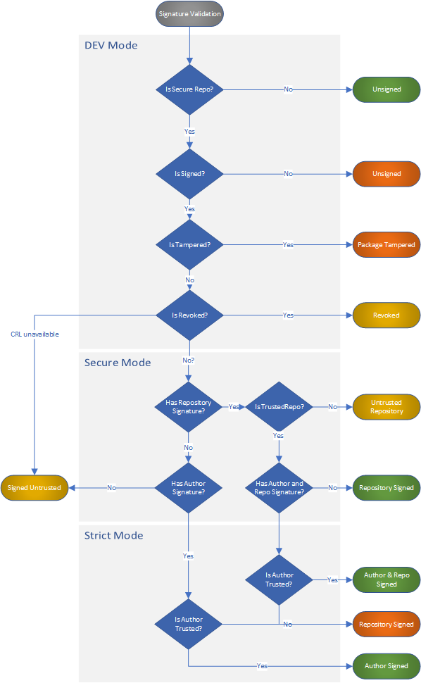

Status: **Reviewing**

## Issue
The discussion around this spec is tracked here - Repository Signatures issue [#6378](https://github.com/NuGet/Home/issues/6378)

## Problem
NuGet packages do not include any mechanism to determine if a given package has been modified from creation to consumption or who is the legitimate author of the package. Content integrity depends on the HTTPS connection used to download the package, but once downloaded it’s not easy to check if the package has been tampered.

[Author signatures](https://github.com/NuGet/Home/wiki/Author-Package-Signing) provide content integrity checks, but they do not address the fact that many packages might depend on packages that have not been signed by their authors. 

## Solution
Repository signatures provide an integrity guarantee for all packages in a repository whether they are author signed or not, even if those packages are obtained from a different location than the original repository where they were signed.

NuGet servers that implement repository signatures must announce the list of certificates used to generate the repository signatures. This announcement will be available as part of the NuGet protocol v3.

NuGet clients who support repository signatures will define the list of repositories they trust. This information is stored in a configuration file that can be customized at different scopes.

During package validation NuGet clients must require that all packages from the claimed repository of origin are signed with one of the certificates included in the configuration file. 

NuGet clients will help synchronize the config file with the certificates exposed by the feed with new gestures to keep the configuration file up to date.

> Note: NuGet servers may choose to produce repository signatures or just host unsigned packages or packages signed by other repositories.

### Non Goals
Repository signatures do not protect against other threats where the repository certificate's private key, or even the whole repository service has been compromised. These threats are protected by advanced monitoring techniques outside the scope of this document.

Package signing in general does not protect from a compromised local machine, where an attacker can change the trusted roots, the repository keys or even the original packages.

### Type of packages based on signature
Considering author and repository signatures there are four possible package signing configurations; no other configurations of these signature types are allowed:

|Package Type|Notes    |
|------------|---------|
|Unsigned|The package does not include any signature.|
|Author|The primary signature is an author signature.|
|Repo|The primary signature is a repository signature.|
|Author and Repo|The primary signature is an author signature, and the signature is repository countersigned.|

>Note: Package repositories can host packages of any of these four types, however once NuGet.org implements repository signatures, all packages in NuGet.org will fall in the last two types.

### Repository Certificates
Repository certificates should chain to a trusted root on the local machine, in the case where the certificate does not, package readers will produce a warning unless the configuration specifies that untrusted certificates are allowed. 

### Repository signature

The [[Package Signatures Technical Details]] spec defines the requirements for all package signatures. The [[Repository Signatures and Countersignatures Technical Specification]] describes the requirements for repository signatures

#### Signature Metadata
The repository signature will include the following metadata:

|Name|Description|Required|
|----|-----------|--------|
|V3 Service Index URL|Official HTTPS URL to the repository V3 service index. (must be HTTPS)|Yes|
|Package Owners|List of the package owners in that repository at the time of submission.|No|

Repository signatures require a NuGet server with a v3 service endpoint. Repositories based on local or shared folders can host packages signed in a different repository, however to produce their own repository signatures they will need to configure an HTTP server to publish the certificates.

### Secure Repository
Repositories who implement the updated service protocol, and sign all their packages with a repository signature will be considered as **Secure Repositories**.

#### NuGet protocol changes to support Repository Signatures
Repositories will announce the certificates used for repository signing as part of the NuGet protocol v3. 

If a repository announces that all packages are repository signed, then a package reader should verify that a package received from the repository is signed as expected or resolve validation failure by a policy.

#### Service Index Resources
The service index API will expose a new resource to allow clients verify the certificates used for package signing. Index service example with new resource:

```json
{
  "version": "3.0.0-beta.1",
  "resources": [
    {
      "@id": "https://api.nuget.org/v3/registration2/",
      "@type": "RegistrationsBaseUrl/3.0.0-rc",
      "comment": "Base URL of Azure storage where NuGet package registration info is stored used by RC clients. This base URL does not include SemVer 2.0.0 packages."
    },
    {
     "@id": "https://api.nuget.org/v3/repository-signature/",
     "@type": "CertificatesBaseUrl/3.0.0-rc",
     "comment" : "BaseUrl for certificate endpoints"
    }
  ]
}
```
This new resource will include an endpoint to discover the list of certificates.  For each certificate the next properties will be shown.  Additionally, the complete certificate will be available as a DER encoded file.

|Certificate Property|Purpose|
|--------------------|-------|
|Thumbprint SHA256|Uniquely identify the certificate|
|Subject Name|Text to display if needed|
|Issued By|Name of the issuer|
|Valid From|Initial date to produce repository signatures|
|Valid To|Last date producing repository signatures|


#### Repository certificate management
Repository administrators can configure the certificates used for repository signing. Over time the certificates will expire and would need to be renewed. Once renewed it will be added to the certificates list, previous certificates should not be removed from the list since that operation will invalidate existing signed packages.

#### Repository certificate revocation
If the repository private key is compromised the certificate must be revoked and all packages signed after the revocation effective date will become invalid and should be signed again with the new certificate. 

Repositories should keep the list of certificate used over time, including the validity period for each.

>Note: There are some limitations in non-Windows platforms, where the revocation status does not include the revocation effective date. If the repository certificate is compromised, all packages should be signed again with the updated certificate.


### Client policies
Client policies allow to customize the security checks. These policies are defined in three modes to enable easy configuration:

-	**Dev Mode**. This is the default mode of operation. It will always verify signed packages, but will enforce signed packages only if the package is downloaded from a repository announcing repository signatures. Trust is only enforced for repository signatures.
 
-	**Secure**. All packages must be signed, no matter the source. Trust verification is enforced in all packages. 

-	**Strict**. Enables advanced locked-down configuration by requiring to explicitly trust package authors.  

|DEV|Secure|Strict|
|---|------|------|
|Allow unsigned from unsecure repositories|Require signed (author or repo) from all repositories|Require signed (author)|
|Enforce content integrity (if signed)|Enforce content integrity|Enforce content integrity|
|Perform revocation checks|Perform revocation checks|Perform revocation checks|
||Enforce trusted repositories|Enforce trusted repositories|
|||Enforce trusted authors|

#### Client configuration
Package readers configure the client policy with the new `signatureValidationMode` property in the `packageRestore` configuration section. NuGet docs will include instructions to update the configuration file even without connection to the repository service index.
The rules to locate this file will follow the NuGet.config rules to work at different scopes.

The sample below shows a sample configuration file:

```xml
<configuration>
  <packageRestore>
    <add key="enabled" value="true" />
    <add key="automatic" value="true" />
    <add key="signatureValidationMode" value="Secure" /> <!-- Default to DEV-->
  </packageRestore>
  <packageSources>
    <add  key="NuGet.org" 
          value="https://api.nuget.org/v3/index.json" 
          protocolVersion="3" />
    <add  key="ContosoSharedRepo" 
          value="https://api.myget.org/F/ContosoRepository" 
          protocolVersion="3" />
    <add  key="ContosoInternalRepo" 
          value="\\Contoso-FS01\ContosoRepository"/>
  </packageSources>
</configuration>
```

#### Trusted Repositories
Users trust specific repositories (and authors TBD) by listing the certificates in the NuGet configuration file. 

```xml
<configuration>
  <trustedRepositories>
    <repository key="NuGet.org">
      <certificate  subjectName="NuGet.org" 
                    thumbprint="a897009b809809c..." />
      <certificate  subjectName="NuGet.org" 
                    thumbprint="6565a656c65b65d..." />
    </repository>
    <repository key="ContosoSharedRepo"                 
                allowSelfSignedCerts="true" >
      <certificate  subjectName="ContosoCert" 
                    thumbprint="98098a0980b980c..." />      
    </repository>
  <trustedRepositories>
  </configuration>
```
>Note: This configuration schema is a high level proposal. The final schema is being definied in a the related [[[Spec] NuGet Config schema changes to enable repository signatures]]

NuGet official clients (VS, NuGet.exe and dotNet.exe) will include the NuGet.org keys by default. Future versions will add new certificates before the previous one gets expired. This means that clients who maintain their versions up to date will have the certificates registered by default. 

Clients running a specific version *forever* will need to update the keys when they expire, or they won't be able to restore packages. To update the keys the can use the CLI or the IDE, or make a manually edit the configuration file.

Repositories should use a code signing certificate issued by a CA, with revocation information support. If the certificate is not trusted, or the certificate revocation information is not available, the restore operation will produce a warning unless the `allowSelfSignedCerts` option is set.

#### Add a new repository
When adding a new repository, the client will query the service index, if repository signatures are announced the client will try to add the keys to the configuration file. These additions will only work if the certificates chain to a trusted root. When adding a repository with untrusted certificates, the client will produce a warning with instructions on how to update the configuration file:

```
nuget source add -Source  https://api.myget.org/F/ContosoRepository

WARNING: The repository <BaseURL> announces certificates that are not in your trusted list configuration, do you want to add the next public keys to your trusted repositories list?
For more information visit https://aka.ms/nuget-sync-keys
```

VS package manager settings will show an icon to distinguish which package sources support repository signatures and will add a new window to see and update the keys.


### Signature Validation
Repository signatures will be validated in the same way as author signatures, just before extraction, as described in the author signatures spec. The next diagram shows the validation process for each client policy with all the possible outcomes: 



Let’s review each of the decisions outlined in this diagram:
-	**Is Signed?** The technical specification defines what is a NuGet signed package.
-	**Is Tampered?** Will compute the file hash and compare it with the hash in the signature, this check enables any content modification detection.
-	**Is Revoked?** The client will try to verify revocation information, and will fail if the certificate is revoked (only if the revocation occurred before the timestamp), but will never fail if the verification cannot be made: CRL not available, Server unavailable, etc.
-	**Has repository Signature?** Based on the technical spec, the client will look for the expected attributes in the primary signature or in the countersignature.
-	**Is Trusted in config?** This check will verify the repository certificate is trusted in the local config. 
-	**Can verify certs from Repo Feed?** When the repository certificate is not trusted, the client should show a warning asking the user to refresh his configuration.
-	**Has author and repo signature?** Once the repository certificate has been validated, the client will check to see if there is an author signature. Note that in Secure mode the author trust check is not enforced.
-	**Is Author Trusted?** The strict mode requires to explicitly trust the package authors. (The full definition of the strict mode will be available later).

When a signed package is found, just before extraction, the package reader must verify the package content integrity. If the computed hash does not match, the package will be considered tampered and the restore operation will fail. 

The DEV client policy will require packages to be signed with the repository signature only if when the repository announces the feature. For other repositories there are no additional enforcements, and all packages must be installed without any user interruption.

The Secure mode enforces that all packages must be signed with author or repo signatures: Author signatures require the signing certificate is trusted in the local machine, typically by the trusted roots certificates, if a package does not have an author signature it will check if there is a repository signature and if the repository is already trusted in the configuration. 

The Strict mode enforces trust with the author, the format to specify the list of trusted authors will be defined in the Client Policies specification.

If the repository is not found in the configuration, the package reader will produce a warning with clear instructions to fix the issue, e.g.:

```
nuget install PackageFromNewRepository -source https://newrepository.com/index.json

ERROR: This Package has been signed by a repository that is not trusted. 
You must update your configuration to include the repository public keys by running: 
‘nuget sync-keys -source https://newrepository.com/index.json’, or using the IDE.

For more information on package signing visit http://aka.ms/nuget-sync-keys 
```

### Create a repository signature
Repository signatures will be added to packages as part of the server ingestion process using the NuGet libraries. NuGet client tools will not expose any CLI command to generate repository signatures but it will support viewing and eventually removing a repository signature from a given package.

>Note: As described in the repository signatures technical specification, only one repository signature is allowed per package. If a repository receives a package with an existing repository signature, the repository should reject or remove the signature to apply their own. **NuGet.org will remove the repository signature of a received packages before adding the NuGet.org repository signature**.

### Client Validation Matrix
Official clients like Visual Studio and Nuget.exe (dotnet.exe will be included later), will be aligned with the 3 stages defined in the original [blog post](https://blog.nuget.org/20170914/NuGet-Package-Signing.html), to summarize:

1. **Stage 1**. Clients will validate author signatures if available, and will ignore repository signatures. 
2. **Stage 2**. Clients will require signed packages from secure repositories, but will allow the installation of unsigned and/or untrusted packages from other sources.
3. **Stage 3**. Clients can opt-in in the secure or strict mode. Visual Studio provides a UI to configure the trusted signers.


Author Trust. In secure mode the author will be considered trusted if it chains to a trusted root in the local machine. In Strict mode it needs to be explicitly trusted in the configuration file. When revocation check cannot be validated, the trust will be considered as “undetermined”.

Repository Trust. Repository trust is determined based on the configuration file, if the certificate does not chain to a trusted root then the trust will be considered as “undetermined”.

#### DEV mode

||Author Trusted|Repo Trusted|Unsigned|Author|Repo|AuthorRepo|
|---|---|---|---|---|---|---|
|Unsecure Repo|N/A|N/A|:white_check_mark:|:white_check_mark:|:white_check_mark:|:white_check_mark:|
|Secure Repo|N/A|N/A|:x:|:x:|:white_check_mark:|:white_check_mark:|


#### Secure mode

Stage 2 clients can opt-in the Secure mode. 

|Author Trusted|Repo Trusted|Unsigned|Author|Repo|AuthorRepo|
|---|---|---|---|---|---|
|No|No|:x:|:x:|:x:|:x:|
|No|Undetermined|:x:|:x:|:warning:|:warning:|
|No|Yes|:x:|:x:|:white_check_mark:|:white_check_mark:|
|Yes|No|:x:|:white_check_mark:|:white_check_mark:|:white_check_mark:|
|Yes|Undetermined|:x:|:white_check_mark:|:white_check_mark:|:white_check_mark:|
|Yes|Yes|:x:|:white_check_mark:|:white_check_mark:|:white_check_mark:|
|Undertermined|No|:x:|:x:|:x:|:x:|
|Undertermined|Undertermined|:x:|:warning:|:warning:|:warning:|
|Undertermined|Yes|:x:|:white_check_mark:|:white_check_mark:|:white_check_mark:|


#### Strict mode

Stage 3 clients can opt-in the Strict mode to define a locked down environment.

|Author Trusted|Repo Trusted|Unsigned|Author|Repo|AuthorRepo|
|---|---|---|---|---|---|
|No|No|:x:|:x:|:x:|:x:|
|No|Undetermined|:x:|:x:|:x:|:x:|
|No|Yes|:x:|:x:|:x:|:x:|
|Yes|No|:x:|:white_check_mark:|:x:|:white_check_mark:|
|Yes|Undetermined|:x:|:white_check_mark:|:x:|:white_check_mark:|
|Yes|Yes|:x:|:white_check_mark:|:x:|:white_check_mark:|
|Undertermined|No|:x:|:x:|:x:|:x:|
|Undertermined|Undertermined|:x:|:x:|:x:|:x:|
|Undertermined|Yes|:x:|:x:|:x:|:x:|