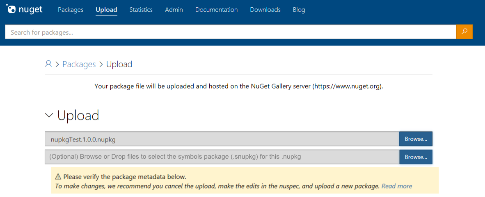
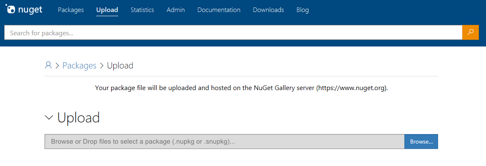

Status: **Reviewing**
# Symbols Package Upload Workflow
## Summary
This spec defines the user experience for uploading NuGet Symbols packages, or .snupkgs, to NuGet.org. This spec only considers the experience for direct upload to NuGet.org through the gallery UI. You will also be able to upload .snupks through the push CLI actions. The spec tracking CLI changes is coming soon.

## GitHub Issue
Let us know what feedback you have at the GitHub [issue](https://github.com/NuGet/Home/issues/6104) tracking the overall experience:
 - **Improve NuGet package debugging and symbols experience [#6104](https://github.com/NuGet/Home/issues/6104)**

## Related Specs
This spec is a part of the overall symbols package workflow. The high level scenario spec is available [here](https://github.com/NuGet/Home/wiki/NuGet-Package-Debugging-&-Symbols-Improvements).

The symbols package creation spec is coming soon.

## User Workflow
To upload a .snupkg, package authors will take the following steps on NuGet.org after signing into their account.

1. Go to the Upload page on NuGet.org
2. If the .nupkg that matches the .snupkg has not previously been uploaded (must match package ID and version exactly), first upload the .nupkg
3. When uploading the .nupkg, NuGet.org will ask for you to upload the corresponding .snupkg

4. If the .nupkg had previously been published (i.e. you only need to upload the .snupkg), you will simply upload the .snupkg on the upload page

5. NuGet.org will check to ensure the matching .nupkg is present and owned by the owner trying to publish the .snupkg, as well as perform basic package validations. 

## Checking Publish Progess
To check the status of the symbols being indexed on the NuGet.org symbol server, package authors can visit the package details page for the .nupkg that matches the .snupkg. While validations are being performed, and the symbols are being indexed, package owners will see a notice on the package details page (similar to what is visible when a .nupkg is uploaded, valided, and indexed). The message will say:
>  The symbols for this package have not been indexed  yet. They are not available for download from the NuGet.org symbol server. Symbols will be indexed and will be available for download after both validation and indexing are complete. Symbols validation and indexing may take up to an hour. Read more (with a link to the documentation). 

Any errors that occur in either validation or indexing will be visible to the package author on the package details page. 

## Validations and Failures
When a .snupkg is uploaded to NuGet.org, we will validate the package to ensure the following:
* The .snupkg package ID and package version already has a .nupkg uploaded, and the owner of the .nupkg is the same as the owner that is trying to upload the .snupkg
* The symbols in the .snupkg match the .dlls in the matching .nupkg
* The .snupkg only contains symbol files, and those symbol files are only portable PDBs (for V1 - Windows PDB support will be later)

When one of these validations fails, the package owner will be notified on their package details page. 

## Updating .snupkgs
If an owner wants to update a .snupkg, they can choose to upload the same .snupkg (same ID and version) to NuGet.org multiple times. Each time the .snupkg is uploaded, any new symbols that are included in the .snupkg will be indexed to the NuGet.org Symbol Server.

This is to support a scenario where you have a .nupkg with foo.dll and bar.dll, and the first .snupkg you upload only contains foo.pdb. If you later decide you want to support symbols for bar.dll (e.g. bar.pdb), you can upload a new .snupkg that has the same ID and version of the previously uploaded .snupkg that contains bar.pdb.

## Removing Symbols from the NuGet.org Symbol Server
If you want to remove Symbols from the NuGet.org symbol server, you have two options:
* You can delete the .snupkgs you have previously uploaded to NuGet.org
* For extremely urgent requests, you can email support@nuget.org and make a support request

When you delete .snupkgs from NuGet.org, there will be an additional service that will clean up the NuGet.org symbol server and will ultimately remove the .pdbs from the NuGet.org symbol server. 

The process of deleting a Symbols Package from NuGet.org will be similar to the process of unlisting (or deleting, if able) NuGet package. You will navigate to the package details page for the package ID that contains the .snupkg you want to delete. If you are signed in as a package owner of the package, you will see an option to 'Delete Symbols'. Selecting this option will take you into the Delete workflow with the following UI:

There will be no Package Version Listing field like you would see for the .nupkg workflow as it is not applicable for just deleting Symbols. Other than that, the UI is nearly identical to the .nupkg delete workflow.

